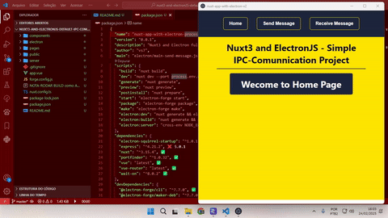

<h2 style="text-align: center;">

nuxt3 and electronJS
</h2>
<h2 style="text-align: center;">

 Default Ipc Comunnication Project

</h2>

[Introdução](#introdução)

# Introduction

how configure nuxt3 and electron project tutorial <br>last Update:`24-02-2025` 
<br>A ready-to-go boilerplate for building cross-platform desktop applications using Nuxt 3 and Electron, pre-configured with development tooling.

----

<div style="text-align: center;">
    
</div>


# Nuxt3 + Electron: Steps to implement

Adding Electron Forge to Your Nuxt Project - Step by Step Guide
Let's transform your Nuxt application into a desktop app using Electron Forge!

### indice <div id="indice"></div>
# Table of Contents

1. [Introduction](#introduction)
2. [Prerequisites](#prerequisites)
3. [Initial Setup](#initial-setup)
   - [Installing Dependencies](#installing-dependencies)
4. [Express Server Configuration](#express-server-configuration)
   - [Express Server Creation](#express-server-creation)
   - [Portfinder Setup](#portfinder-setup)
5. [BrowserWindow Setup](#browserwindow-setup)
   - [Main Window Creation](#main-window-creation)
   - [Development and Production Functions](#development-and-production-functions)
6. [IPC Communication](#ipc-communication)
   - [Preload Script](#preload-script)
   - [Backend to Frontend Messages](#backend-to-frontend-messages)
7. [Electron Forge Configuration](#electron-forge-configuration)
8. [Running Commands](#running-commands)
   - [Development Mode](#development-mode)
   - [Production Build](#production-build)
9. [Additional Notes](#additional-notes)


## Prerequisites - Build a Nuxt Project
- [Pré-requisitos](#pré-requisitos)
## Pré-requisitos
# Prerequisites

1. criar um projeto nuxt
    acessa o site official do nuxt3
        https://nuxt.com/docs/getting-started/installation

        apos criar o projeto, acessar a pasta do projeto e instalar as dependencias
        no arquivo `package.json`
        caso tenha remova 
          `"type":"module"`
        roda o comando `npm i`
        testa o projeto
        `npm run dev`

2. Install Required Dependencies


## Configuração Inicial
# Initial Setup
### Instalação de Dependências
## Installing Dependencies

First, let's add Electron and related dependencies:

```bash
npm install --save-dev electron  @electron-forge/cli
````

##### depois as outras bibliotecas do electron 

```bash
npm install --save-dev @electron-forge/maker-squirrel @electron-forge/maker-zip @electron-forge/maker-deb @electron-forge/maker-rpm 
```

##### depois a bibliotecas complementares


## Configuração do Express Server

# Express Server Configuration
## Express Server Creation

## Portfinder Setup

```bash
npm i express portfinder wait-on  
```

and

```bash
npm i --save-dev cross-env concurrently 
```

---------
### 3. Initialize Electron Forge

### Now Open Terminal and Initialize Electron-forge to Project

```bash
npx electron-forge import
```

### create Electron Files

## Criação do BrowserWindow
# BrowserWindow Setup
## Main Window Creation

4. Create Main Electron Files
Create a new file in Folder `electron/main.js`:

```
const { app, BrowserWindow } = require('electron')
const path = require('path')
const express = require('express')
const waitOn = require('wait-on')
const portfinder = require('portfinder')

let mainWindow;

async function createWindow(url) {
  const mainWindow = new BrowserWindow({
    width: 1200,
    height: 800,
    webPreferences: {
      nodeIntegration: false, // Recommended security setting. Prevents renderer process code from having Node.js access.
      contextIsolation: true,  // Recommended security setting. Isolates the renderer process context to prevent access to the main process's globals.
      preload: path.join(__dirname, 'preload.js') // Path to the preload script that will be injected into the renderer process.
  }
  })
  await mainWindow.loadURL(url)
}

async function startDevelopmentMode() {
  const port = process.env.PORT || 3000
  const devServerUrl = `http://localhost:${port}`
  
  await waitOn({
    resources: [devServerUrl],
    timeout: 360000
  })
  
  await createWindow(devServerUrl)
}

async function startProductionMode() {
  const expressApp = express()
  
  // Configure portfinder
  portfinder.basePort = 3030
  
  // Serve static files
  expressApp.use(express.static(path.join(__dirname, '../.output/public')))
  
  try {
    const port = await portfinder.getPortPromise()
    expressApp.listen(port, () => {
      console.log(`Production server running on port ${port}`)
      createWindow(`http://localhost:${port}`)
    })
  } catch (err) {
    console.error('Failed to find an open port:', err)
    throw err
  }
}

app.whenReady().then(async () => {
  if (process.env.NODE_ENV === 'development') {
    console.log('Starting in development mode...')
    await startDevelopmentMode()
  } else {
    console.log('Starting in production mode...')
    await startProductionMode()
  }

  app.on('activate', async () => {
    if (BrowserWindow.getAllWindows().length === 0) {
      if (process.env.NODE_ENV === 'development') {
        await startDevelopmentMode()
      } else {
        await startProductionMode()
      }
    }
  })


})

app.on('window-all-closed', () => {
  if (process.platform !== 'darwin') {
    app.quit()
  }
})


```

### Create a new file in Folder `electron/main-send-message.js`

```
const { app, BrowserWindow,dialog,ipcMain  } = require('electron')
const path = require('path')
const express = require('express')
const waitOn = require('wait-on')
const portfinder = require('portfinder')


let mainWindow

async function createWindow(url) {
  //const win = new BrowserWindow({
  mainWindow = new BrowserWindow({
    //desativa o menu
    autoHideMenuBar: true,
    width: 640,
    height: 800,
    webPreferences: {
      nodeIntegration: false, // Recommended security setting. Prevents renderer process code from having Node.js access.
      contextIsolation: true,  // Recommended security setting. Isolates the renderer process context to prevent access to the main process's globals.
      preload: path.join(__dirname, 'preload.js') // Path to the preload script that will be injected into the renderer process.
  }
  })
  await mainWindow.loadURL(url)


      //ativa envio de mensagens do back-end para o front-end
        // Start automatic message sender
        startAutoMessageSender()
}


// **Temporary message sender to frontend (for demonstration)**
// This function simulates sending messages to the frontend, similar to push notifications or real-time updates.
// It is for demonstration purposes and should be replaced with your actual backend logic for sending messages.
function startAutoMessageSender() {
  let counter = 1
  setInterval(() => {
      if (mainWindow) {
          const autoMessage = `Automatic Message #${counter}`
          mainWindow.webContents.send('message-from-main', autoMessage) // Send message to the renderer process via 'message-from-main' channel.
          counter++
      }
  }, 1500) // Send a message every 1.5 seconds. Adjust the interval as needed.
}

async function startDevelopmentMode() {
  const port = process.env.PORT || 3000
  const devServerUrl = `http://localhost:${port}`
  
  await waitOn({
    resources: [devServerUrl],
    timeout: 360000
  })
  
  await createWindow(devServerUrl)
}

async function startProductionMode() {
  const expressApp = express()
  
  // Configure portfinder
  portfinder.basePort = 3030
  
  // Serve static files
  expressApp.use(express.static(path.join(__dirname, '../.output/public')))
  
  try {
    const port = await portfinder.getPortPromise()
    expressApp.listen(port, () => {
      console.log(`Production server running on port ${port}`)
      createWindow(`http://localhost:${port}`)
    })
  } catch (err) {
    console.error('Failed to find an open port:', err)
    throw err
  }
}

app.whenReady().then(async () => {
  if (process.env.NODE_ENV === 'development') {
    console.log('Starting in development mode...')
    await startDevelopmentMode()
  } else {
    console.log('Starting in production mode...')
    await startProductionMode()
  }

  app.on('activate', async () => {
    if (BrowserWindow.getAllWindows().length === 0) {
      if (process.env.NODE_ENV === 'development') {
        await startDevelopmentMode()
      } else {
        await startProductionMode()
      }
    }
  })


  ipcMain.on('message-to-main', (event, message) => {
    // **Handle messages from the frontend**
    // This section listens for messages sent from the renderer process (frontend) to the main process (backend) on the 'message-to-main' channel.
    console.log('Message received from frontend:', message)
    // **Echo message back to all windows (including the sender)**
    // For demonstration, this line sends the received message back to all browser windows via the 'message-from-main' channel.
    // In a real application, you might process the message here and send a different response or trigger other backend actions.
    mainWindow.webContents.send('message-from-main', message)

        // Exibir um alerta quando uma mensagem for recebida do frontend
        dialog.showMessageBox(mainWindow, {
          type: 'info',
          title: 'Mensagem Recebida',
          message: 'Mensagem recebida do frontend:',
          detail: message,
          buttons: ['OK']
      })
})
})

app.on('window-all-closed', () => {
  if (process.platform !== 'darwin') {
    app.quit()
  }
})


```

### Create a new file in Folder `electron/preload.js`
# IPC Communication
## Preload Script


```
const { contextBridge, ipcRenderer } = require('electron')

contextBridge.exposeInMainWorld('electron', {
    send: (channel, data) => {
        ipcRenderer.send(channel, data)
    },
    receive: (channel, callback) => {
        const subscription = (event, ...args) => callback(...args)
        ipcRenderer.on(channel, subscription)
        return () => ipcRenderer.removeListener(channel, subscription)
    }
})

```

## Execução e Comandos

### Comandos para desenvolvimento e construção
# Running Commands
## Development Mode

### Now Update Your package.json

### 5. Update package.json
Add these scripts to your package.json:

```
"scripts":{
    "electron:dev": "nuxt generate && electron-forge start",
    "electron:build": "nuxt generate && electron-forge make",
    "electron:server": "cross-env NODE_ENV=development PORT=3312 concurrently \"nuxt dev\" \"electron-forge start\""
}
```


#### `electron:dev`

1. the `electron:serve` => start nuxt Server and Run the project in electron View


#### `electron:build`

2. the `electron:dev` => compile the project and run in electron View


#### `electron:server`
### note: for use the command `electron:buid` open the Terminal IN Super User Mode 'administrador'

3. the `electron:build`  make the build final for production


## Notas adicionais
# Electron Forge Configuration
### Configuração de `forge.config.js`

### Now Configure And Update Your Build Package File `forge.config.js`

file: `forge.config.js`

````
const { FusesPlugin } = require('@electron-forge/plugin-fuses');
const { FuseV1Options, FuseVersion } = require('@electron/fuses');

const startTime = new Date(); // Registra o tempo de início

module.exports = {
  packagerConfig: {
    asar: true,
  },
  extraResource: ['.output/public'],
  ignore: [
    /^\/\.output\/public/,
  ],
  copyFiles: {
    from: '.output/public',
    to: 'dist'
  },
  rebuildConfig: {
    parallel: true,
    numberOfCores: 0
  },
  electronRebuildConfig: {
    parallel: true,
    numberOfCores: 0,
    forceABI: 89
  },
  makers: [
    {
      name: '@electron-forge/maker-squirrel',
      config: {
        parallel: true
      },
    },
    {
      name: '@electron-forge/maker-zip',
      platforms: ['darwin', 'win32', 'linux'],
    },
    {
      name: '@electron-forge/maker-deb',
      config: {
        options: {
          parallel: true
        }
      },
    },
    {
      name: '@electron-forge/maker-rpm',
      config: {
        options: {
          parallel: true
        }
      },
    },
  ],
  plugins: [
    {
      name: '@electron-forge/plugin-auto-unpack-natives',
      config: {
        parallel: true
      },
    },
    new FusesPlugin({
      version: FuseVersion.V1,
      [FuseV1Options.RunAsNode]: false,
      [FuseV1Options.EnableCookieEncryption]: true,
      [FuseV1Options.EnableNodeOptionsEnvironmentVariable]: false,
      [FuseV1Options.EnableNodeCliInspectArguments]: false,
      [FuseV1Options.EnableEmbeddedAsarIntegrityValidation]: true,
      [FuseV1Options.OnlyLoadAppFromAsar]: true,
    }),
  ],
  hooks: {
    postMake: async () => {
      const endTime = new Date(); // Registra o tempo de término
      const duration = (endTime - startTime) / 1000; // Calcula a duração em segundos
      const minutes = Math.floor(duration / 60);
      const seconds = Math.floor(duration % 60);
      console.log(`Build completed in ${minutes} minutes and ${seconds} seconds.`);
    }
  }
};

```


------- 
### Sobre o uso de `electron:build` em modo administrador
# Additional Notes
## Production Build
## note: for use the command `electron:buid` open the Terminal IN Super User Mode 'administrador'

3. the `electron:build`  make the build final for production


### Full Package.json File

````
{
  "name": "nuxt-app-with-electron-process-communication",
  "version": "0.0.1",
  "description": "Nuxt3 and Electron full Integration Projeto from Dev To Build App",
  "author": "vs7",
  "main": "electron/main-send-message.js",
  "scripts": {
    "build": "nuxt build",
    "dev": "nuxt dev --port process.env.PORT",
    "generate": "nuxt generate",
    "preview": "nuxt preview",
    "postinstall": "nuxt prepare",
    "start": "electron-forge start",
    "package": "electron-forge package",
    "make": "electron-forge make",
    "electron:dev": "nuxt generate && electron-forge start",
    "electron:build": "nuxt generate && electron-forge make",
    "electron:server": "cross-env NODE_ENV=development PORT=3312 concurrently \"nuxt dev\" \"electron-forge start\""
  },
  "dependencies": {
    "electron-squirrel-startup": "^1.0.1",
    "express": "^4.21.2",
    "nuxt": "^3.15.4",
    "portfinder": "^1.0.32",
    "vue": "latest",
    "vue-router": "latest",
    "wait-on": "^8.0.2"
  },
  "devDependencies": {
    "@electron-forge/cli": "^7.7.0",
    "@electron-forge/maker-deb": "^7.7.0",
    "@electron-forge/maker-rpm": "^7.7.0",
    "@electron-forge/maker-squirrel": "^7.7.0",
    "@electron-forge/maker-zip": "^7.7.0",
    "@electron-forge/plugin-auto-unpack-natives": "^7.7.0",
    "@electron-forge/plugin-fuses": "^7.7.0",
    "@electron/fuses": "^1.8.0",
    "concurrently": "^9.1.2",
    "cross-env": "^7.0.3",
    "electron": "^34.2.0"
  }
}


```


